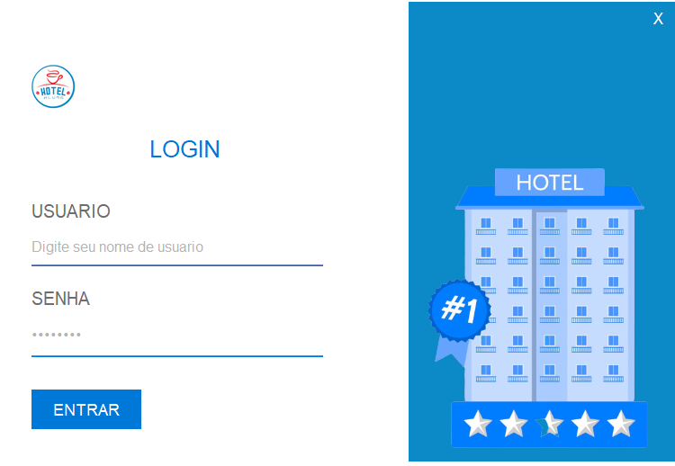
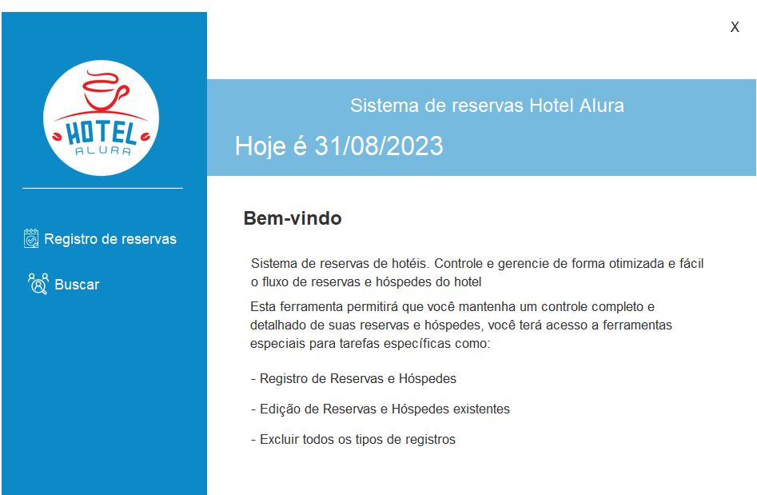
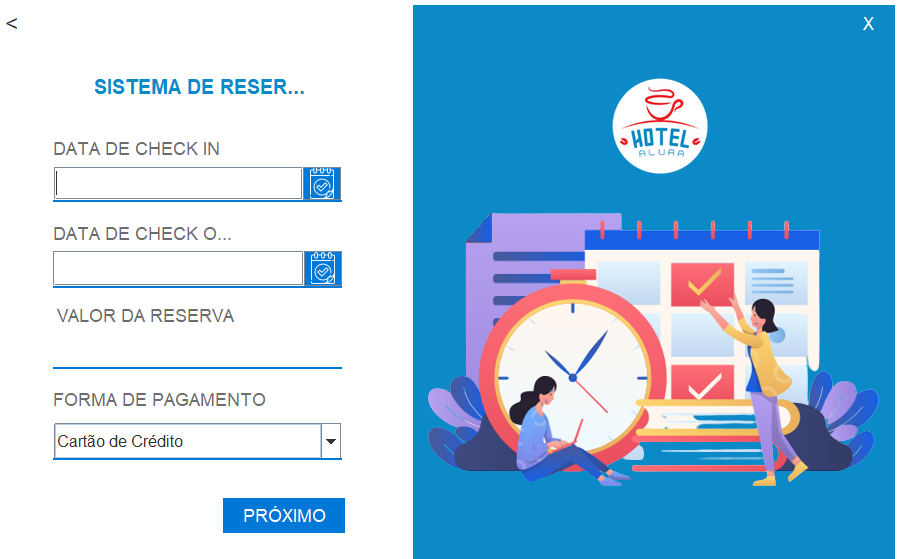

<h1> Este é o Hotel Alura</h1>

 Este projeto foi desencolvido na linguagem Java para a conclusão de um dos challengers da formação Oracle One Next Education, parceria da Oracle com a Alura.

<h2>O que este App Faz?</h2>

Trata-se de aplicativo para gerenciamento de reservas de um hotel. O app realiza o cadastro de hospedes e reservas, consultas das reservas e hospedes cadastrados, assim como a edição e exclusão dos dados

<h2>Tecnologias utilizadas</h2>
<ul>
 <li>Java SDK 20</li>
 <li>Java Swing</li>
 <li>Java JDBC</li>
 <li>Java C3P0 Pool</li>
 <li>MySql 8.0</li>
</ul>

<h2>Como Instalar</h2>

<h2>Telas do APP</h2>

<h3>Tela Principal</h3>

<h3>Tela de Login</h3>

<h3>Tela Menu</h3>

Nesta tela o usuário pode escolher se deseja cadastrar uma reserva ou consultar uma reserva ja registrada.

<h2>Tela de Cadastro de Reservas</h2>

Aqui o usuário preenche os dados da reserva e o valor é calculado automáticamente levando em consideração o número de dias entre a data de entrade e saída e o valor da diária que está fixado em R$20,00

 
